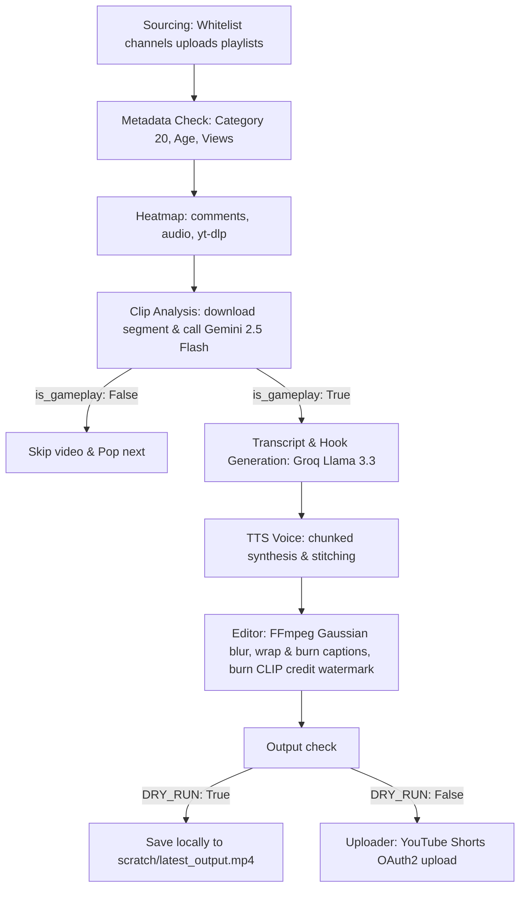

# GTA6 Shorts Pipeline — Project Handover & Documentation

This document serves as a comprehensive guide for any AI agent or developer taking over the **GTA6 Shorts Pipeline** project.

## Current Project Status
*   **Core Engine**: Fully implemented in `pipeline/*.py`. All modules follow strict error boundaries (try/except), comprehensive logging, and standard pathlib path resolutions.
*   **Infrastructure**: Qwen3-TTS 1.7B voice cloning backend deployed on Modal with speed control and chunk-based synthesis.
*   **Visual Analysis & Gameplay Filter**: Single-call Gemini 2.5 Flash API for clip scene understanding, boundary detection, and gameplay validation using Pydantic structured schemas.
*   **Hook Generation**: Two-stage LLM pipeline (Groq/Llama 3.3 70B) with rotating delivery styles and markup for natural TTS phrasing.
*   **Voice Synthesis**: Tone variation and strategic pauses implemented by chunking hooks at delivery markers (`...` and `—`), synthesizing chunks at custom speeds, and stitching them with 280ms silences.
*   **Video Editor**: Crop to 9:16 vertical format, high-quality Gaussian background blur, word wrapping, and stylized safe-zone captions using thick outlines and 3D drop shadows (Oswald Bold font).
*   **On-Screen Credit Watermark**: Translucent overlay (`CLIP: @[CHANNEL_NAME]`) burned at `x=50:y=100` on the vertical crop to credit original creators and ensure fair-use compliance.
*   **Sourcing & Whitelist Filters**: Exclusive sourcing from curated gameplay channels (Red Arcade, Prestige Clips, Hazardous, whatever57010, DarkViperAU, Call Me Kevin) by querying uploads playlists directly.
*   **Priority-Weighted Ranking**: Channels are configured with priority multipliers:
    *   **High Priority (2.0x Boost)**: Hazardous, whatever57010, Red Arcade, Prestige Clips.
    *   **Low Priority (0.5x multiplier)**: DarkViperAU, Call Me Kevin.
    *   Videos are ranked dynamically: `score = base_score * priority_multiplier`.
*   **Dry-Run Mode**: Pipeline executes fully but bypasses YouTube uploads, saving output locally to `scratch/latest_output.mp4` for quality control review.
*   **Automation**: GitHub Actions workflows created for daily processing (`daily.yml`) and weekly performance tracking (`fetch_stats.yml`).

---

## Technical Architecture

The pipeline follows a **Search (Whitelist Sync) → Analyze → Generate → Compose → Upload (or Dry Run)** flow:



1.  **Sourcing** (`pipeline/search.py`): If `config.SOURCING["mode"] == "whitelist"`, fetches the latest 5 uploads from each whitelisted channel's uploads playlist (`UU...` ID). Bypasses global YouTube search to consume almost zero API quota.
2.  **Metadata Check & Scoring** (`pipeline/search.py`): Restricts candidate videos strictly to category `20` (Gaming), checks that published age is under 7 days (`max_age_hours: 168`), and view count is above 2,000. Multiplies the calculated base score by the channel's priority multiplier (2.0x or 0.5x).
3.  **Heatmap** (`pipeline/heatmap.py`): Detects viral spikes in the video timeline using comments, audio peaks, yt-dlp heatmap data, or 30% duration fallback.
4.  **Clip Analysis** (`pipeline/clip_analyzer.py`): Downloads a segment and calls Gemini 2.5 Flash with a structured Pydantic schema to validate gameplay (`is_gameplay`), generate description, and identify natural boundaries.
5.  **Hook** (`pipeline/hook.py`): Calls Groq Llama 3.3 70B to write a hook rotating through 4 styles (Shocked, Deadpan, Hype, Storyteller) and applies delivery markup.
6.  **Voice** (`pipeline/voice.py`): Splits the marked-up hook into chunks, synthesizes them at distinct speeds using Modal Qwen3-TTS, and stitches them with 280ms silences.
7.  **Editor** (`pipeline/editor.py`): Crops backdrop to 9:16, applies Gaussian blur, and burns dynamic captions. Dynamically burns a translucent credit watermark (`CLIP: @[CHANNEL_NAME]`) at `x=50:y=100` to credit the creator.
8.  **Uploader / Dry Run** (`pipeline.py`): If `config.DRY_RUN` is active, copies the completed short to `scratch/latest_output.mp4` and skips upload. Otherwise, executes the OAuth2 resumable upload to YouTube Shorts.

---

## Directory Structure
```text
/workspaces/gra-6-clippper/
├── .github/workflows/   # daily.yml, fetch_stats.yml
├── assets/              # Oswald-Bold.ttf, Montserrat-Black.ttf, voice_sample.wav
├── data/                # queue.json, performance_log.json
├── pipeline/            # Core Python modules
│   ├── search.py        # Whitelist uploads syncing + eligibility & priority scoring
│   ├── heatmap.py       # Viral moment detection (4 signals)
│   ├── clip_analyzer.py # Gemini 2.5 Flash structured visual analysis
│   ├── transcript.py    # Caption extraction
│   ├── hook.py          # Two-stage hook generation + delivery markup
│   ├── voice.py         # Chunk-based TTS synthesis + WAV stitching
│   ├── editor.py        # FFmpeg cropping, Gaussian blur, caption styling, watermark credits
│   ├── uploader.py      # YouTube Shorts OAuth2 upload
│   └── queue_manager.py # Queue management
├── modal_tts.py         # Modal TTS deployment (1.7B parameter Qwen3-TTS)
├── config.py            # All pipeline constants, whitelist channel IDs, and DRY_RUN settings
├── pipeline.py          # Main orchestrator
└── fetch_stats.py       # Weekly stats updater
```

---

## Setup & Secrets
The following environment variables are required in `.env` (local) and GitHub Secrets (Actions):
*   `YOUTUBE_API_KEY`: Sourcing search and comments fetching.
*   `YOUTUBE_OAUTH_JSON`: Complete JSON credential string (OAuth2 refresh token).
*   `GROQ_API_KEY`: Groq Llama 3.3 hook generation.
*   `GEMINI_API_KEY`: Gemini 2.5 Flash API file upload and structured queries.
*   `MODAL_TTS_ENDPOINT`: Modal voice cloning endpoint.
*   `REF_TEXT`: Text prompt for voice sample reference alignment.
*   `YOUTUBE_COOKIES_PATH`: Netscape cookie file path to bypass downloader bot challenges.
