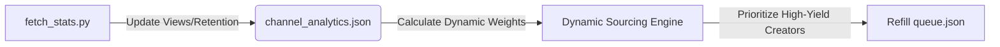

# GTA6 Shorts Pipeline — Architectural Scaling & Future Roadmap

This document outlines a long-term technical roadmap for scaling the **GTA6 Shorts Pipeline** beyond its current scope. It focuses on engineering enhancements, algorithmic optimizations, and automated feedback loops that are not covered in the existing files (`GEMINI.md`, `PROGRESS.md`, or `TESTING.md`).

---

## 1. Algorithmic Feedback Loops (Performance-Driven Optimization)

Currently, channel priority multipliers in `config.py` are static (e.g., `2.0x` for Red Arcade, `0.5x` for DarkViperAU). We can close the loop between the **Weekly Performance Stats** (`fetch_stats.py`) and the **Daily Pipeline Sourcing** (`pipeline.py`) to create a self-optimizing engine.



### Technical Design:
*   **Dynamic Priority Adjuster (`pipeline/sourcing_optimizer.py`):**
    Introduce a scoring module that runs before sourcing. It reads `data/channel_analytics.json` and adjusts the priority multiplier dynamically using the following formula:
    $$\text{Multiplier}_{\text{new}} = \text{Multiplier}_{\text{base}} \times \left(1 + \tanh\left(\frac{\text{AvgViews}_{7\text{d}} - \overline{\text{AvgViews}}}{\sigma_{\text{views}}}\right)\right) \times (1 - \text{RejectionRate})$$
    where:
    *   $\overline{\text{AvgViews}}$ is the mean 7d view count across all tracked channels.
    *   $\sigma_{\text{views}}$ is the standard deviation of views.
    *   $\text{RejectionRate}$ is the visual filter fail rate from Gemini (penalizes channels that frequently upload non-gameplay or low-punchiness content).
*   **Prompt Optimization Loop:**
    Correlate hook styles (`shocked`, `deadpan`, `hype`, `storyteller`) stored in `performance_log.json` with their average 24h retention/views. Feed the highest-performing styles as few-shot examples back to Groq Llama 3.3 in `pipeline/hook.py`.

---

## 2. Audio-Visual Composition Upgrades

To maximize viewer retention on YouTube Shorts, we can transition from static blurring and cropping to dynamic visual layout engines.

### 2.1. Dynamic Dual-Screen Layouts (Retention Boosters)
*   **Concept:** Split-screen Shorts featuring GTA gameplay on top and satisfying/parkour video loops on the bottom (a highly successful layout pattern for Gen-Z viewer retention).
*   **FFmpeg Filter Graph Implementation:**
    ```text
    [0:v] scale=1080:960, crop=1080:960:x:y [top];
    [1:v] scale=1080:960, crop=1080:960:cx:cy [bottom];
    [top][bottom] vstack=inputs=2 [outv]
    ```
    This stacks the gameplay stream and a pre-cached background stream (e.g., Minecraft parkour, ASMR sand cutting) vertically, maintaining a perfect 1080x1920 viewport.

### 2.2. Automated Soundtrack & Sound Effects (SFX) Mixing
*   **Background Music (BGM) Ducking:**
    Dynamically overlay low-volume background tracks behind the generated speech. Apply an audio compressor filter in FFmpeg to "duck" the music track volume by `12dB` whenever the voice track is speaking:
    ```text
    -filter_complex "[0:a]volume=1.0[voice];[1:a]sidechaincompress=threshold=-20dB:ratio=4:release=500[music];[voice][music]amix=inputs=2"
    ```
*   **Procedural SFX Placement:**
    Add transitional "swoosh" or "boom" sound effects exactly at the junction boundary between the Hook section and the Reveal section to emphasize the payoff point.

---

## 3. Visual Sourcing & Quality Filters

Currently, downloading relies strictly on metadata queries. We need automated guards to filter out low-quality files and incompatible video layouts before passing them to the visual analyzer.

### 3.1. Technical Validation Checks
*   **Resolution and Bitrate Guards:**
    Reject any sourced stream that falls below 1080p or has a video bitrate under `3500 kbps` to protect visual presentation standards:
    ```python
    info = ffprobe_info(download_path)
    if info.get("width", 0) < 1920 or info.get("height", 0) < 1080:
        raise ValueError("Video resolution too low")
    ```
*   **Facecam & Layout Obstruction Detection:**
    GTA creators often place facecams or stream overlays at the top-left or bottom-right of the screen. Since vertical cropping cuts out the sides, any center-left facecam will block the gameplay. 
    *   **Solution:** Use a lightweight computer vision script (e.g., OpenCV template matching or Edge-Detection grids) to analyze the crop zone frames (`[x=420, y=0, w=1080, h=1920]`) and flag static bounding boxes showing high-contrast edges typical of webcam frames.

---

## 4. Infrastructure & Pipeline Resiliency

Running workflows entirely in GitHub Actions presents limitations on file storage, execution times, and long-term authentication stability.

### 4.1. Cloud Offloading (AWS S3 or GCP Storage Integration)
Currently, `queue.json` and logs are committed directly to the git history. Over months, storing binary files or large logs will bloat the repository.
*   **Goal:** Store all historical short assets (`test_output_short.mp4`), voice cloned audio cache, and the JSON queue files in an S3 Bucket.
*   **Integration:**
    ```python
    import boto3
    s3 = boto3.client('s3')
    s3.upload_file('data/queue.json', 'gta-shorts-bucket', 'queue.json')
    ```
    GitHub Action runs can fetch the queue at startup and push updates to S3 at completion, keeping the git history pristine.

### 4.2. Self-Healing OAuth Token Service
Google OAuth2 refresh tokens can occasionally expire or invalidate if the channel is idle, blocking uploads.
*   **Solution:** Set up a lightweight, serverless function (Vercel or Google Cloud Functions) running a daily check that refreshes the YouTube OAuth credentials, verifies upload permissions, and notifies you via Slack/Discord webhooks if the credentials fail.

---

## 5. Implementation Phasing

Here is a recommended roadmap for prioritizing these upgrades:

| Phase | Component | Target Task | Complexity | Impact |
| :--- | :--- | :--- | :--- | :--- |
| **Phase 1** | Resiliency | Set up AWS S3 bucket queue offloading & Git cleanup | Medium | High |
| **Phase 2** | Quality Guards | Add FFprobe resolution filters & Facecam detection logic | Low | Medium |
| **Phase 3** | Audio Upgrades | Implement dynamic BGM ducking and transitional SFX | Medium | High |
| **Phase 4** | Layout Engine | Implement dual-screen layouts (Minecraft/Satisfying bottom) | High | Very High |
| **Phase 5** | ML Feedback | Establish dynamic priority score calculations | High | Medium |
