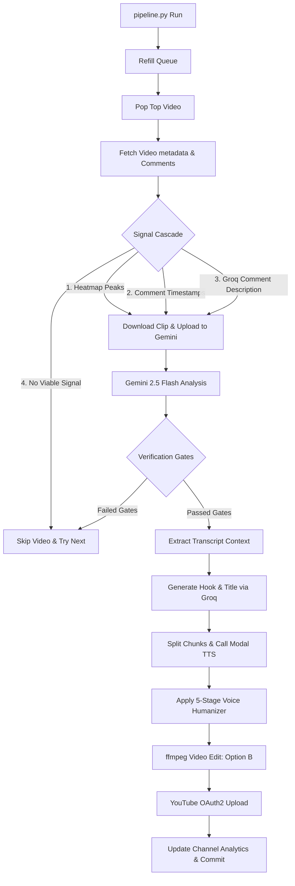

# Pipeline Architecture Walkthrough: End-to-End Shorts Production

This document provides a highly detailed, technical walkthrough of the automated YouTube Shorts pipeline. It explains how raw YouTube videos are sourced, processed, analyzed, edited, voiced, and published, outlining every code function, logic decision, and configuration variable involved.

---

## High-Level System Architecture

The pipeline follows a **7-stage linear workflow** orchestrated by `pipeline.py`. Each daily run tries to process videos from the queue until a short is successfully produced (or the retry limit is reached).



---

## 1. Sourcing & Queue Management (`search.py`, `queue_manager.py`, `channel_discovery.py`)

The pipeline relies on sourcing high-potential videos to feed the editor. Sourcing is configured in [config.py](file:///workspaces/gra-6-clippper/config.py) and handled in [search.py](file:///workspaces/gra-6-clippper/pipeline/search.py) and [queue_manager.py](file:///workspaces/gra-6-clippper/pipeline/queue_manager.py).

### Sourcing Modes
- **Whitelist Mode** (`config.SOURCING["mode"] == "whitelist"`): Fetches the 5 most recent uploads for every channel defined in `config.SOURCING["whitelist_channels"]` (such as `Hazardous`, `whatever57010`, `Prestige Clips`, and `Red Arcade`) using the channel's uploads playlist ID (replacing `UC` with `UU` in the channel ID).
- **Search Mode** (`config.SOURCING["mode"] == "search"`): Queries the YouTube Data API globally using query lists in `config.CONTENT_TIERS`.

### Content Tiers & Fallback
1. **Primary Tier (`gta6`)**: Sourced using queries like `"GTA 6 gameplay walkthrough"`. Eligible videos must have at least 20,000 views, be under 48 hours old, and come from channels with at least 10,000 subscribers.
2. **Secondary Tier Fallback (`gta5`)**: Triggered if the pending queue size drops below `config.QUEUE["min_size"]` (default 3). Queries `"GTA 5 stunts gameplay"` with a wider eligibility window (at least 50,000 views, age under 168 hours, channel subs > 25,000).
3. **Discovery Mode**: Triggered if the queue drops below `config.DISCOVERY["trigger_queue_size"]` (default 2). Sourced globally from non-whitelist/non-blacklist channels.

### Eligibility Checks & Sourcing Gates
Before any heavy data fetching or processing, a candidate video must pass several strict gates in `search.is_eligible()`:
- **Gate 1: Pre-API Title/Description Blacklist**: Checks if the title contains banned phrases indicating reviews, reactions, map comparisons, or wrong games (e.g., `analysis`, `leak`, `podcast`, `reaction`, `minecraft`, `fortnite`) to avoid quota waste.
- **Gate 2: Channel Checks**: Excludes Rockstar Games official channels (to avoid copying raw trailers) and channels listed in `config.CHANNEL_BLACKLIST`.
- **Gate 3: Category Filter**: Restricts videos strictly to category ID `20` (Gaming).
- **Gate 4: Keyword Check**: Must contain at least one positive GTA keyword (e.g., `gta`, `grand theft auto`, `trevor`, `vice city`).
- **Gate 5: Durations & Ratios**: Video duration must be between 240s (4 minutes) and 3600s (1 hour). Like-to-view ratio must be $\ge$ `config.ELIGIBILITY["min_like_ratio"]` (0.02).

### Video Scoring Formula
Videos are scored in `search.score_video()` to prioritize sorting inside `data/queue.json`:
$$\text{Base Score} = (\text{Views} \times \text{Recency Weight}) + (\text{Like Ratio} \times 50000)$$
Where:
- $\text{Recency Weight} = 1.0$ (age < 12h), $0.7$ (age < 24h), or $0.4$ (age $\ge$ 24h).
- The final score is multiplied by a **channel priority multiplier** loaded from [channel_analytics.json](file:///workspaces/gra-6-clippper/data/channel_analytics.json) (ranges from $0.78$ to $1.5$ depending on historic performance).
- Sourced videos are appended to the pending queue, sorted in descending order of score, and capped at `config.QUEUE["max_pending"]` (default 20).

### Channel Discovery Sourcing
If a video sourced in discovery mode is processed, its outcome is tracked in `channel_discovery.process_candidate_result()`:
- Each success incremented in `clips_passed` pushes the channel closer to whitelist promotion.
- If a channel reaches `promotion_threshold` (3 passed clips), it is **automatically promoted** to the whitelist in `config.py` by appending a dictionary above the `# END WHITELIST` marker.
- If a channel reaches `demotion_threshold` (5 attempted clips with 0 passes), it is **automatically blacklisted** in `config.py` by appending its name above the `# END CHANNEL_BLACKLIST` marker.

---

## 2. Sourced Video Processing & The Signal Cascade (`pipeline.py`, `heatmap.py`)

Once a video is popped from the queue via `queue_manager.pop_top()`, the pipeline fetches comments (up to 100 top level comments) via the YouTube API and metadata via a single `yt-dlp` call in `heatmap.get_video_metadata()`. It then runs the **Signal Cascade** to locate the exact second where the viral moment happens.

```
Metadata Fetch (yt-dlp)
    │
    ├──► Signal 1: Heatmap multi-peak detection (top 3 peaks)
    │              * If found, try peak 1, 2, then 3 through Gemini gates
    │
    ├──► Signal 2: Comment regex timestamp extraction (if Signal 1 fails/absent)
    │              * Extracts timestamp patterns (e.g. "1:23") and clusters mentions
    │              * Evaluates best comment peak through Gemini gates
    │
    ├──► Signal 3: Comment text semantic analysis via Groq (if Signal 2 fails/absent)
    │              * Llama-3.3 summarizes the moment description & position (early/middle/late)
    │              * Evaluates 2-3 position segments through Gemini gates
    │
    └──► Signal 4: Skip video (if all signals are absent or fail validation gates)
```

### Signal 1: Heatmap Multi-Peak Detection
If `yt-dlp` returns a rewatch heatmap (represented as list of segments with start, end, and rewatch intensity value):
1. `heatmap.find_top_peaks()` runs a sliding window of size `config.CLIP["max_duration_seconds"] - 3` (9.0s) at steps of 0.5s over the video duration.
2. It identifies the top 3 non-overlapping windows sorted by cumulative intensity.
3. The pipeline tries these peaks in order. Each peak center is passed to the video verification phase.

### Signal 2: Comment Timestamp Regex Extraction
If heatmap data is unavailable, the pipeline falls back to extracting structured timeline references from viewer comments:
1. `heatmap.extract_and_score_timestamps()` matches timestamps using `\b(?:(\d{1,2}):)?(\d{1,2}):(\d{2})\b` (supporting `H:MM:SS`, `MM:SS`, or `M:SS`).
2. Mentions are weighted by comment like count: $\text{Weight} = 1.0 + \text{likes}$.
3. Nearby timestamps are grouped and smoothed using a window of $\pm 2$ seconds.
4. The highest-scoring timestamp is tried as the viral peak.

### Signal 3: Comment Semantic Analysis via Groq
If there are no explicit timestamps, the comments are processed semantically to isolate the action:
1. `heatmap.analyze_comments_for_moment()` compiles the top 30 comments by like count and prompts `llama-3.3-70b-versatile` to locate what viewers are laughing or screaming at, returning JSON containing `moment_description`, `position_hint` (`early` | `middle` | `late`), and `confidence`.
2. If `confidence >= 0.3`, `heatmap.get_position_segments()` generates 3 segment windows centered around key portions of the video (e.g., `positions = [0.10, 0.25, 0.40]` for `early`).
3. Overlapping segments (overlap > 50%) are deduplicated. Each segment center is evaluated in sequence.

---

## 3. Clip Verification & Natural Boundary Detection (`clip_analyzer.py`, `clip_validator.py`)

For any candidate peak timestamp found, the pipeline evaluates the raw visual action.

### Segment Download & Gemini File Upload
1. The pipeline downloads a temporal buffer around the target peak (from `peak - 30.0s` to `peak + 90.0s`) using `yt-dlp` with `--download-sections`. This ensures the multimodal model has ample context before and after the moment.
2. The MP4 is uploaded to the **Gemini File API** via `client.files.upload()`. The code polls the file state every 3 seconds until it transitions to `ACTIVE`.

### Multimodal Analysis with Gemini 2.5 Flash
`clip_analyzer.analyze_with_gemini()` sends the active file reference along with the top-liked timestamp comment as context to `gemini-2.5-flash`. The model responds strictly with the `VideoAnalysis` Pydantic schema:
- `is_gameplay` (bool): Excludes facecams, talking heads, slides, and podcast footage.
- `is_punchy` (bool): Ensures the action or comedy can be understood in under 15 seconds without excessive buildup.
- `description` (str): Exactly one sentence describing the physics, stunts, crashes, or glitches.
- `natural_start` / `natural_end` (float): The local timestamps inside the downloaded segment where the setup begins and the reaction ends.
- `viral_score` (int): A rating from 1 to 10 evaluating visual rewatch potential.

### Boundary Clamping
Immediately after receiving boundaries from Gemini, `clip_analyzer.clamp_boundaries()` enforces project constraints:
- **Maximum Duration**: Clamps the window to `config.CLIP["max_duration_seconds"]` (12.0s) if the model returns an overly long segment.
- **Minimum Duration**: Extends the window to `config.CLIP["min_duration_seconds"]` (10.0s) if the returned segment is too short.
- **Peak Integrity**: If the peak timestamp is pushed outside the window during adjustment, the clip is re-centered around the peak (`start = peak - 4.0s`, `end = start + 12.0s`).
- **Global Mapping**: The local boundaries are mapped back to global video time.

### Verification Gates
The clip must pass three validation checks:
1. **Gameplay & Punchiness check**: `is_gameplay` and `is_punchy` must be True.
2. **Viral Score Gate**: `viral_score` must be $\ge$ `config.CLIP["min_viral_score"]` (default 7).
3. **Vagueness Check**: `clip_validator.check_vagueness()` scores the description. It adds points for active verbs (`+2`), specific objects (`+1`), and physics terms (`+2`) while applying penalties (`-3`) for generic phrases (e.g. `"gameplay footage"`). The description is rejected if the score is $< 3$.
4. **Cross-Validation against Comments**: `clip_validator.validate_vs_comments()` uses Groq to verify if the Gemini visual description matches the physical events described in the viewer comments. A mismatch rejects the clip.

---

## 4. Title & Hook Scripting (`hook.py`)

If a clip passes all gates, the pipeline extracts the transcript text around the peak (using `transcript.get_video_context()`) to check for spoken dialogue. It then generates the viral hook and title.

### Content Strategy Profiles
Hook generation is customized via the active content profile in `config.py`:
- `tts_narrated`: Blurred setup, TTS narration hook, word-by-word captions, and a dramatic tone.
- `pure_gameplay`: Instant action (no blur), minimal captions, no TTS (authentic game audio only), and casual slang captions.
- `reference_inspired`: Blurred setup, 5-7 word casual TTS narration, followed by a sudden game-audio reveal.

### Curiosity Gap Title Generation
`hook.generate_viral_title()` prompts Groq Llama-3.3 to write a high-CTR title based on the visual description and hook text:
- Must be between 3 and 6 words.
- Must tease the setup but never reveal the outcome (the **Curiosity Gap**).
- Must capitalize exactly 1-2 emotional words (e.g., `"This GTA physics is BROKEN 🤯"`).
- Competitor channel names are automatically filtered out using regex.

### Scripting the Hook
`hook.get_hook_with_fallback()` manages hook creation:
1. It selects a random hook delivery style (e.g. `shocked`, `deadpan`, `hype`, `storyteller`) to prevent repetitiveness.
2. It queries Groq using a raw hook prompt to generate a 1-sentence reaction script under the word limit (e.g. 7 words for reference-inspired).
3. The hook is sent back to Groq to add **delivery markup** for the TTS engine. The model injects ellipses `...` for strategic pauses and CAPITALIZES words to emphasize.
4. Hooks are validated to ensure they are 3-18 words long and do not end in weak question marks.

---

## 5. Audio Generation & Humanization (`voice.py`, `voice_humanizer.py`)

The marked-up hook script is processed through a voice generation and humanization pipeline.

```
"Wait... they actually LANDED on the helicopter"
                    │
                    ▼ [split_into_chunks]
   Chunk 1 (Suspense): "Wait" (Speed: 0.95x)
   Chunk 2 (Reveal):   "they actually LANDED on the helicopter" (Speed: 1.10x)
                    │
                    ▼ [Modal TTS Endpoint]
   Synthesize individual WAV segments using cloned voice
                    │
                    ▼ [WAV Parser & Stitcher]
   [Breath Pad (100ms)] + [Chunk 1] + [Gap (180ms)] + [Chunk 2]
                    │
                    ▼ [5-Stage Voice Humanizer]
   1. Time-Stretch ──► 2. Pitch Jitter ──► 3. Dynamics ──► 4. Room Tone ──► 5. Reverb/EQ
```

### Chunk-Based Synthesis
1. `voice.split_into_chunks()` splits the script at markup boundaries (`...` or `—`).
2. Chunks are labeled as `suspense` (slow, build-up) or `reveal` (fast, payoff) and assigned distinct speech rates from the profile (e.g. `speed_suspense: 0.95`, `speed_reveal: 1.10`).
3. Chunks are sent to the `MODAL_TTS_ENDPOINT` rotation pool. The payload includes the text, a base64-encoded reference voice sample (`assets/voice_sample.wav`), a reference transcript, and the target speed.
4. The system rotates to backup endpoints if the primary endpoint fails.

### Stitching Gaps
PCM audio data from successfully synthesized chunks is stitched together:
- Adds a starting silent breath pad (e.g. 100ms).
- Injects a silent chunk gap (e.g. 180ms) between the suspense chunk and the reveal chunk, creating a clean pacing structure.

### The 5-Stage Voice Humanizer
The stitched WAV file is passed to `voice_humanizer.py` for professional post-processing:
1. **Stage 1: Time-Stretch**: Uses `librosa.effects.time_stretch` to adjust audio speed without shifting the pitch.
2. **Stage 2: Pitch Jitter**: Evaluates the audio in 200ms overlapping Hann windows and applies micro pitch shifts ($\pm 1\%$ semitones) using `librosa.effects.pitch_shift` to mimic human vocal instability.
3. **Stage 3: Word-Level Dynamics**: Detects onsets (word boundaries) and applies subtle random volume variations ($\pm 1.5$ dB) to individual words. It then runs a frame-by-frame compressor (threshold: -18dB, ratio: 2.0:1) to smooth out the audio.
4. **Stage 4: Room Tone & Breaths**: Generates continuous Brownian noise at -42dB to create a natural room tone. It also identifies silent gaps in the audio track and injects synthetic breath sounds (filtered pink noise bandpassed between 200Hz and 2kHz) into gaps longer than 150ms.
5. **Stage 5: Reverb & EQ Warmth**: Convolves the audio with an exponential decay impulse response to simulate room reverb (RT60: 0.1s), blends it with the dry signal (15% wet), applies a high-shelf EQ cut above 12kHz, adds a low-shelf warm boost at 150Hz (+1.5dB), and peak-normalizes the output to -1dBFS.

---

## 6. Video Composition & Editing (`editor.py`)

The pipeline edits the final Short using `ffmpeg` commands managed in `editor.py`. It uses a **backdrop approach** (Option B) to match standard creator formats.

```
BACKDROP (0s to hook_duration)
   [Source: start of video]
   Trim to hook_dur ──► Scale & Crop (1080x1920) ──► Heavy Gblur (sigma=20) ──► Merge TTS audio ──► Burn captions
                                                                                                        │
REVEAL (hook_duration to end)                                                                           ▼
   [Source: global_start to global_end]                                                            [Concatenate]
   Trim reveal_dur ──► Scale & Crop (1080x1920) ──► Retain original game audio ────────────────────────► Final Short
```

### Part 1: Backdrop Creation (The Hook Section)
1. **Backdrop Source**: The pipeline downloads the first few seconds of the video (from 0.0s to the hook duration) to use as a background.
2. **Trim & Crop**: The backdrop is trimmed to the exact duration of the voiceover track and scaled/cropped to 1080x1920 using `force_original_aspect_ratio=increase` (preventing black letterboxes on non-standard inputs).
3. **Watermark**: Burns a credit watermark (`CLIP: @channel_name` at opacity 0.6) in the upper-left corner of the video.
4. **Blur**: Applies a heavy gaussian blur (`gblur=sigma=20:steps=3`) to obscure the background action, forcing the viewer to focus on the hook captions.
5. **TTS Audio Integration**: Merges the blurred video with the humanized TTS audio track.
6. **Captions**: Burns the hook text onto the video using [Oswald-Bold.ttf](file:///workspaces/gra-6-clippper/assets/Oswald-Bold.ttf) centered in the frame.
   - For `reference_inspired` mode, captions are burned word-by-word using timed drawtext filters (`enable='between(t, start, end)'`).
   - For standard mode, captions are wrapped into multi-line blocks.

### Part 2: Reveal Section
1. **Trim & Crop**: The pipeline downloads the actual action sequence starting exactly at `global_start` (the natural boundary identified by Gemini) for a calculated duration.
   - The reveal duration is capped dynamically (`reveal_duration = 59.0 - hook_duration`) to ensure the total Short remains under 59.0 seconds.
2. **Cropping**: Scaled and cropped to 1080x1920 with the creator credit watermark burned in.
3. **Audio**: The game audio for this section is left completely intact.

### Part 3: Concatenation
The pipeline concatenates the hook section and the reveal section into a single MP4 file. The transition creates a visual payoff: the video begins with a blurred setup and a voiceover hook, then cuts to the clear gameplay action with its original audio.

---

## 7. Uploading & Performance Tracking (`uploader.py`, `channel_tracker.py`)

If `config.DRY_RUN` is False, the output Short is published to YouTube and its performance is tracked.

### YouTube OAuth2 Upload
`uploader.upload_short()` builds an authenticated client using OAuth2 refresh tokens stored in `YOUTUBE_OAUTH_JSON`:
- Refreshes tokens automatically at runtime.
- Runs a resumable media upload in 5MB chunks, handling transient connection drops with up to 3 retries.
- Sets the privacy status to `public` and category to `20` (Gaming).

### Metadata & SEO Optimization
- **Titles**: Appends relevant hashtags (`#Shorts` and topic-specific hashtags) to the Groq-generated title.
- **Descriptions**: Automatically formats descriptions to include:
  1. The detailed visual description (for YouTube search SEO indexing).
  2. Clickable link credit to the original video source.
  3. Clean text credit to the creator (`Sourced from: @channel`).
  4. Call-to-action engagement prompts and profile tags.

### Performance Analytics & Leaderboards
The tracking system operates using [channel_tracker.py](file:///workspaces/gra-6-clippper/pipeline/channel_tracker.py):
1. **Daily Updates**: During runs, it checks previous uploads in `data/performance_log.json` and updates stats at 24h, 72h, and 7d intervals.
2. **Channel Analytics Aggregation**: It groups performance entries by source channel and calculates metrics inside [channel_analytics.json](file:///workspaces/gra-6-clippper/data/channel_analytics.json), including total uploads, rejection rates, and average 7d views.
3. **Leaderboard Tracking**: Channels are ranked by a **Priority Score** (1 to 10) calculated as:
   - A base view score mapped from average 7-day views (e.g. 50k views = 8.5 points, 10k views = 6.5 points).
   - Multiplied by a rejection rate factor: $\text{multiplier} = \max(0.5, 1.0 - (\text{rejection\_rate} \times 0.5))$.
   - Adjusted by a average virality rating boost.
4. **Leaderboard Output**: Generates a terminal report ranking source channels. High-scoring channels receive a priority boost in subsequent runs, while poor-performing channels are deprioritized.
